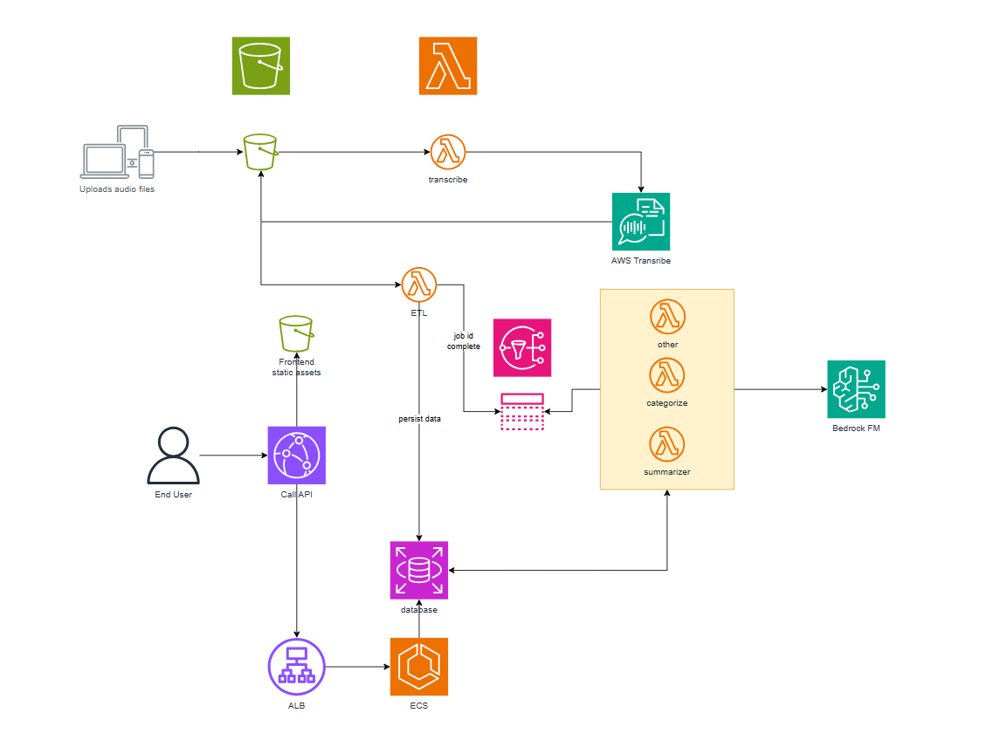

# Transcribe.it Documentation

## **Purpose**

The primary objective of **Transcribe.it** is to offer a comprehensive and user-friendly solution for audio transcription. By leveraging advanced AWS services, the platform allows users to seamlessly upload audio files, process them into transcripts, and access detailed summaries. The solution is designed to enhance accessibility and efficiency for individuals and organizations needing accurate and concise transcriptions.

### **Key Features**
- **Audio File Upload:** Audio files are upload to S3 via IoT devices
- **AWS Transcribe Integration:** Audio files are processed using AWS Transcribe for high-accuracy transcription.
- **Database Storage:** Transcriptions are securely stored in a database for easy retrieval and reference.
- **Summarization:** Summaries of transcripts are generated using AWS Bedrock, offering users a clear and concise overview of the content.
- **Web Platform Access:** Users can view, search, and retrieve transcripts directly from a web platform.

---

## **Solution Architecture Diagram**

Below is a high-level diagram outlining the workflow and integration of services within the Transcribe.it platform:

### **Workflow Steps**
1. **File Upload:**
   - Audio files are upload to S3 via IoT devices, Smartphones or Smartwatches
2. **Transcription:**
   - Uploaded files are processed by AWS Transcribe to generate text-based transcripts.
3. **Storage:**
   - Transcripts are stored securely in a database for later access.
4. **Summarization:**
   - AWS Bedrock processes the transcripts to generate summaries, emphasizing key points and details.
5. **User Access:**
   - Transcripts and summaries are made accessible on the web platform for viewing, or further analysis.

---

## **Useful Links**

### **End User Website**
Explore the web platform to upload audio files, view transcriptions, and access summaries:  
[End User Website](https://dpawe0k8y1mxa.cloudfront.net/)

### **RESTful API**
Developers can integrate the transcription and summarization services into their applications using the RESTful API:  
[RESTful API](https://transcribe-it.matm.xyz/api)

---

## **Technology Stack**

### **Core Services**
- **AWS Transcribe:** For converting audio into text with high accuracy.
- **AWS Bedrock:** For generating objective summaries from transcriptions.
- **Database:** A secure storage solution to maintain transcripts and metadata.
- **CloudFront CDN:** Ensures fast, scalable, and reliable web access for end users.

### **Additional Tools**
- **Web Platform:** Built with a responsive design for seamless user interaction.
- **API Integration:** Facilitates external application access to transcription and summarization features.

This documentation provides an overview of the **Transcribe.it** platform, its architecture, and the tools used to deliver efficient transcription and summarization solutions.
